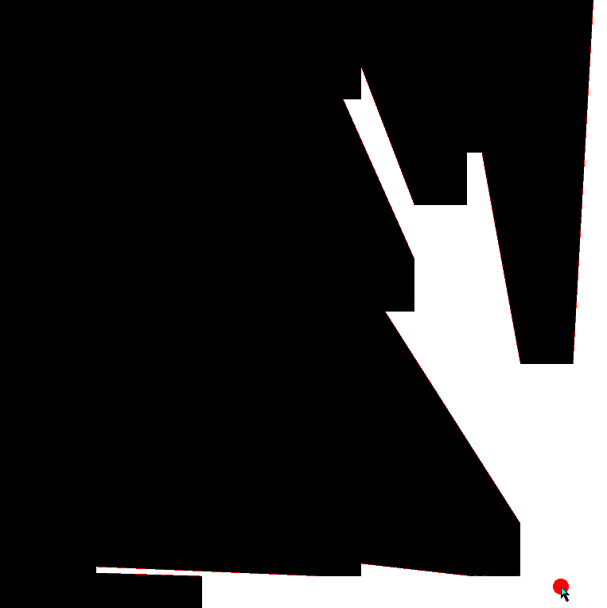

# 2D-Shadows
This is a pretty cool 2D shadow caster demo. In the release, there are two executables:

## Shadows v1.0.0.exe

The demo by itself; Pretty cool. 

## Shadows_line v1.0.0.exe

This shows how the demo works. Basically, it takes the vertex of every object on screen, draws a ray to it, and fills in the resulting triangles white to make it appear the circle is "shining" a light to it, as seen in [this](https://ncase.me/sight-and-light/) blog.
